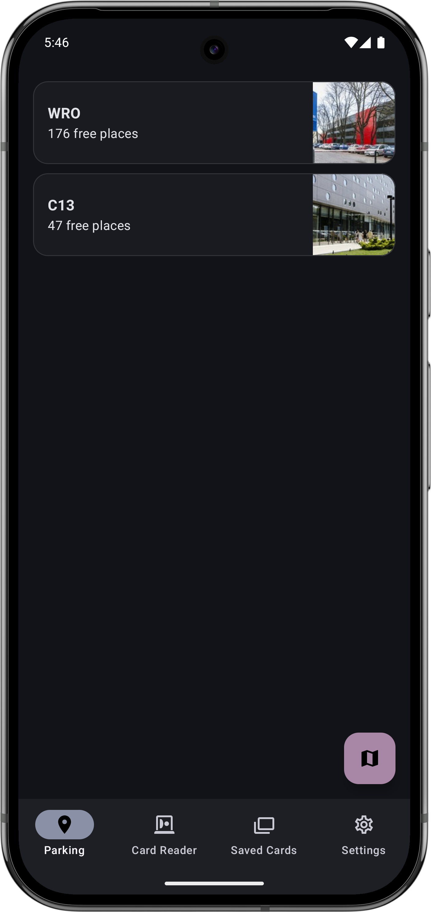
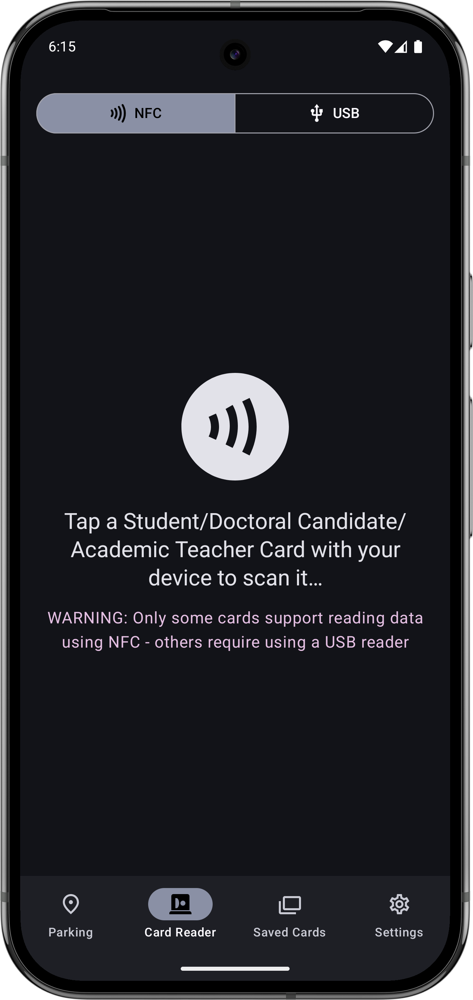
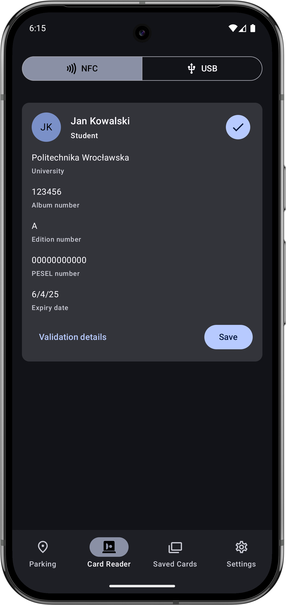
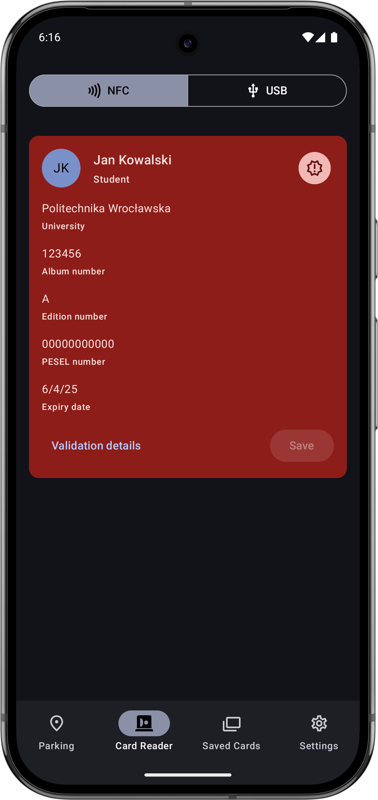
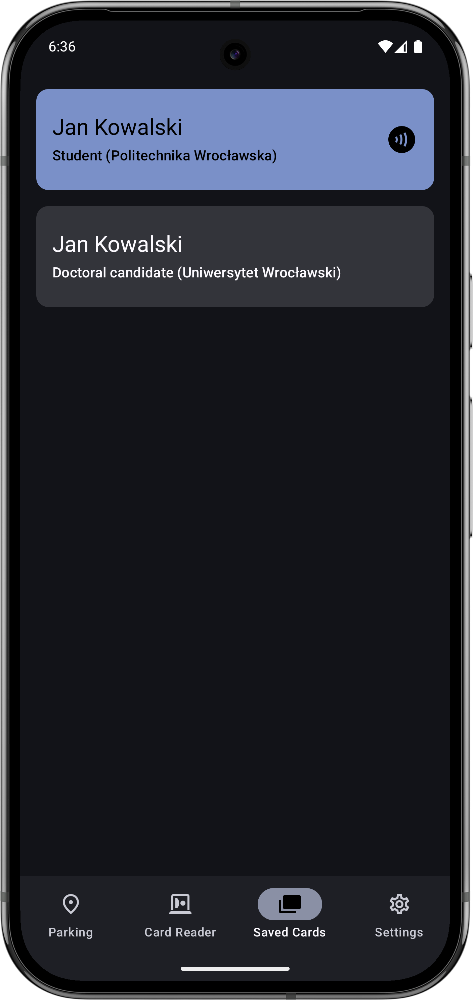

# Legitnik

An Android app for reading and verifying Polish student/doctoral candidate/academic teacher cards
and viewing parking lot information for the WUST.

## Features

### Polish Student/Doctoral Candidate/Academic Teacher Cards

- Read cards using phone's NFC module or using a smart card reader connected via USB
- Verify the contents (including the Qualified Electronic Signature)
- Emulate the data, making it readable by other users of the app

### WUST Parking Lots

- View the list of parking lots alongside the number of free spaces
- Check the historical availability of the lot
- View the parking lots on a map

## Screenshots

|                                                     |                                                      |                                                       |                                                               |                                                   |
|-----------------------------------------------------|------------------------------------------------------|-------------------------------------------------------|---------------------------------------------------------------|---------------------------------------------------|
|  |  |  |  |  |

## Building

### GitHub Signerry Maven Repository

In order to obtain the required dependencies from the GitHub Maven repository used you'll need to
configure credentials for it in Gradle. In order to do that you'll need to:

1. Create a GitHub Personal Access Token
    1. Open https://github.com/settings/tokens?type=beta
    2. Generate a new token with read-only public repositories/read packages access
2. Configure your credentials
    1. Select a
       [way to set the Gradle properties](https://docs.gradle.org/current/userguide/build_environment.html)
       (e.g. modifying `~/.gradle/gradle.properties` or setting env vars with names
       `ORG_GRADLE_PROJECT_propertyName`)
    2. Set the `githubSignerryUsername` property to your GitHub username
       (`githubUsername=YOUR_USERNAME`)
    3. Set the `githubSignerryPassword` property to the generated PAT
       (`githubPassword=GENERATED_PAT`)
